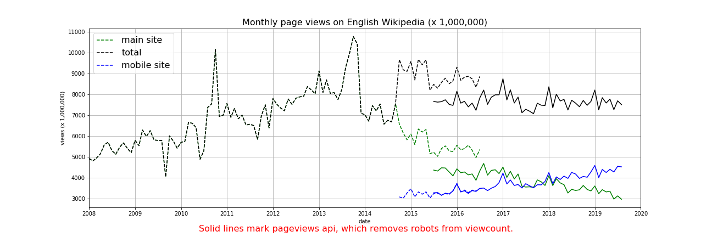

# Data 512A - A1: Data curation

## Project goal

The code in this repository shows how to gather, analyze and graph monthly view traffic on the English Wikipedia. The code looks at the data from January 1st 2008 through August 30th 2019.

## Repository structure

```bash├── LICENSE  
├── README.md  
├── assets  
│   └── images  
│       └── wikipedia_page_views.png  
├── clean_data  
│   └── en-wikipedia-traffic_200801-201908.csv  
├── human.yml  
├── raw_data  
│   ├── legacy_desktop-site_200801-201908.json  
│   ├── legacy_mobile-site_200801-201908.json  
│   ├── pageviews_desktop_200801-201908.json  
│   ├── pageviews_mobile-app_200801-201908.json  
│   └── pageviews_mobile-web_200801-201908.json  
└── src  
    └── hcds-a1-data-curation.ipynb
```

## Resources

We used two public apis to gather the data:

* The [Legacy Pagecounts](https://wikitech.wikimedia.org/wiki/Analytics/AQS/Legacy_Pagecounts#Monthly_counts)
* The [Pageviews](https://wikitech.wikimedia.org/wiki/Analytics/AQS/Pageviews)

Which are licenced under the [CC-BY-SA 3.0](https://creativecommons.org/licenses/by-sa/3.0/) and [GFDL](https://www.gnu.org/copyleft/fdl.html) license. More licensing and usage information is available at the api documentation [website](https://wikimedia.org/api/rest_v1/#/). The two apis above are labeled 'Legacy data' and 'Pageviews data' respectively as of 10/02/2019.

## How to run the notebook

You will need a computer with access to the internet and access to a command line which has the required previledges to install open-source software.

1. Install [conda or miniconda](https://docs.conda.io/projects/conda/en/latest/user-guide/install/).
2. [Replicate the conda environment](https://docs.conda.io/projects/conda/en/latest/user-guide/tasks/manage-environments.html#creating-an-environment-from-an-environment-yml-file) using the human.yml file provided by running: `conda env create -f human.yml`
3. Activate the environment with: `conda activate human`
4. Using a terminal or cmd, navigate to the src folder.
5. Lauch jupyter by running: `jupyter notebook`
6. Select the hcds-a1-data-curation notebook.

## Results issues and considerations

### Results



The cleaned data file `en-wikipedia-traffic_200801-201908.csv`, has the following format

| Column                  |   Value   | Description                                                           |
|-------------------------|:---------:|-----------------------------------------------------------------------|
| year                    |    YYYY   | Year of view                                                          |
| month                   |     MM    | Month of view                                                         |
| pagecount_all_views     | num_views | Combined view count for desktop and mobile views for the legacy api   |
| pagecount_desktop_views | num_views | View count from a desktop in the legacy api                           |
| pagecount_mobile_views  | num_views | View count from mobile in the legacy api                              |
| pageview_all_views      | num_views | Combined view count for desktop and mobile views for the pageview api |
| pageview_desktop_views  | num_views | View count from a desktop in the pageview api                         |
| pageview_mobile_views   | num_views | View count from a mobile in the pageview api                          |

**Months for which no data was available have a value of 0.**

### Considerations

Data from the Legacy Pagecounts API has desktop and mobile data from December 2007 to July 2016. 

* The last data point for these monthly series '2016-08' are incomplete and were removed during analysis.
* The Legacy Pagecounts API **includes views from crawlers and spiders**.

Data from the Pageviews API has desktop and mobile data from July 2015 through last month.

* The api can filter out crawlers and spiders.
* The api differentiate between the mobile app and the mobile site. This information was not leveraged as we combined these counts in our analysis.
